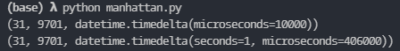

# NPuzzle-AStar

## Experiments

### Manhattan: Cpp Built-in vs Python Hand-written

Cpp built-in is approximately hundred folds faster than python binding.

### MLP vs Manhattan: 15-25 steps during training

### MLP vs Manhattan: 30 steps

### MLP vs Manhattan: 35 steps

MLP Heuristic could be hundred folds better than Manhattan heuristic.

### CNN vs Manhattan: 25 steps

